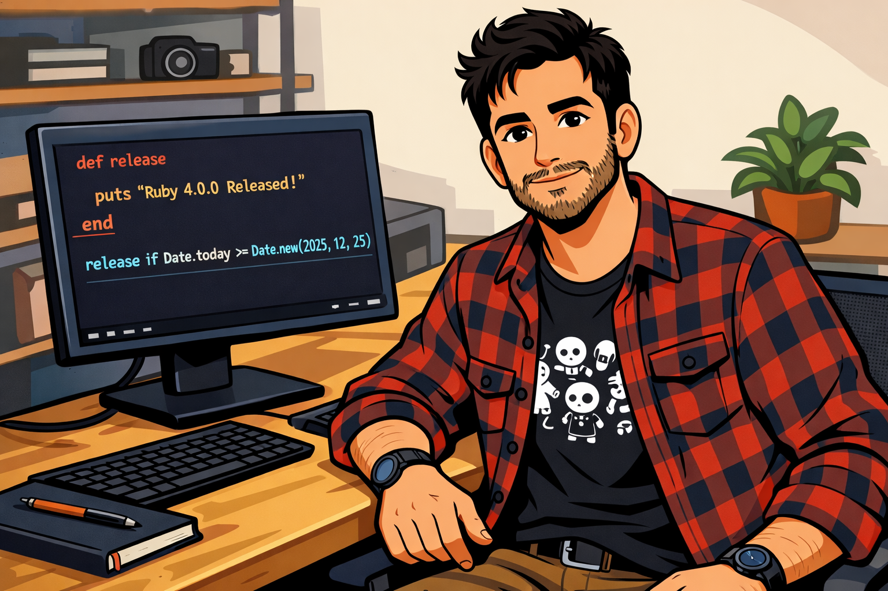

# Novidades do Ruby 4.0

## 📒 Descrição

O [notebook LM](https://notebooklm.google.com) é uma ferramenta de IA criada pelo Google para estudo, pesquisa e análise de documentos, funcionando como um “caderno inteligente” que entende e trabalha diretamente com os materiais que você envia. Dentre as principais novidades que eu explorei foi sobre em adicionar fontes com base em Prompt de comandos, com isso não temos mais a necessidade de adicionar manualmente as fontes. Além disso tambem podemos gerar videos, aprensetação, inforgráficos, podcast e outros tipos de conteudo.

## 🤖 Tecnologias Utilizadas
- IA Generativa **[notebook LM](https://notebooklm.google.com)** para levantar as fontes de conecimento e gerar um podcast e video resumo sobre as atualizações do Ruby 4.0;
- IA Generativa **[Microsoft Copilot](https://copilot.microsoft.com/)** para elaborar e revisar o texto e gerar a thumbnail;
- IA Generativa **[Chat GPT](https://chatgpt.com/)** para elaborar prompts para gerar imagem e gerar imagens;

## 🧐 Processo de Criação

### Video e Poscast

Para iniciar o processo, criei um novo notebook na ferramenta **NotebookLM**. Assim que o notebook foi aberto, a plataforma disponibilizou uma caixa de prompt para inserir comandos. Nessa área, solicitei: *"Busque o lançamento e as novidades sobre o Ruby 4.0"*. Também selecionei a opção de busca aprofundada, garantindo que o sistema reunisse informações mais completas e detalhadas sobre o tema.

Depois que o NotebookLM concluiu todo o processamento, acessei o painel lateral esquerdo — chamado Estúdio. Nesse espaço, escolhi gerar dois tipos de resumo a partir das informações coletadas:

- um resumo em áudio (podcast)
- um resumo em vídeo

Ambos foram criados automaticamente pela ferramenta. Em seguida, fiz o download dos arquivos gerados e os anexei ao projeto.

### Thumbnail

Para criar a thumbnail, utilizei o **ChatGPT**. Primeiro, pedi que ele gerasse um prompt baseado em uma foto pessoal, de modo que minhas características fossem preservadas. Com esse prompt, solicitei a criação de uma imagem em um ambiente de trabalho, exibindo na tela um código em Ruby (que eu mesmo escrevi).
Após receber a primeira versão, pedi que a imagem fosse convertida para um estilo cartoon, resultando na arte final utilizada no projeto.

> Usei o **Microsoft Copilot** para revisar o texto e deixar o mais explicativo
## 🚀 Resultados
- [Video](midia/Ruby.Box_e_ZJIT_no_Ruby_4.m4a)
- [Podcast](midia/Ruby.Box_e_ZJIT_no_Ruby_4.m4a)
- [Link do NotebookLM](https://notebooklm.google.com/notebook/d88f2208-9fd7-489c-b0f6-5ad51bd90bdc)

## 💭 Reflexão (Opcional)

A ferramenta tem evoluído de forma notável, oferecendo recursos cada vez mais avançados — como a possibilidade de interagir diretamente com suas próprias fontes de dados. Enxergo um grande potencial para aplicações educacionais, especialmente por sua capacidade de transformar anotações em conhecimento estruturado, facilitando o aprendizado e a assimilação de novos conteúdos.

